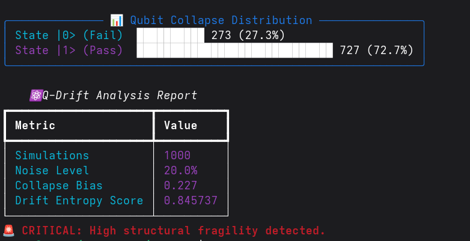

# ⚛️ Q-Drift CLI – Quantum-Inspired Structural Drift Analyzer

> **"Software stability is the successful resistance to quantum-like superposition in the face of noise."**

`q-drift` is a professional command-line tool designed to measure the **fragility** of logic paths and decision-making processes under uncertainty. Inspired by quantum mechanical principles—specifically **superposition** and **amplitude damping**—it simulates how environmental noise (latency, race conditions, or jitter) affects system reliability.

## 🚀 Key Features

* **Quantum-Inspired Simulation:** Models probabilistic state collapses using a Signal Decay (Amplitude Damping) model.
* **Entropy & Bias Metrics:** Quantifies structural drift and deviation from stable, deterministic logic using Shannon Entropy.
* **Visual Analytics:** Beautiful terminal output with professional tables and ASCII distribution charts.
* **Deterministic Mode:** Support for `--seed` to ensure scientific reproducibility in experiments.
* **DevOps Ready:** Exportable JSON reports and a dedicated `--ci-mode` for seamless integration into CI/CD pipelines.

## 💡 Demo Example

Analyze your system's stability with default noise parameters:

```bash
python main.py analyze
```

## 📊 Visual Output

The CLI generates a real-time ASCII distribution chart and a metrics table directly in your terminal.



### ⚙️ JSON Export
Perfect for automated monitoring and DevOps pipelines:

```bash
python main.py analyze --output results.json
```

## 🛠️ Installation & Setup

1. **Clone the repository:**
```bash
git clone [https://github.com/Shel-y/q-drift.git](https://github.com/Shel-y/q-drift.git)
cd q-drift

```


2. **Create a virtual environment (Recommended):**
```bash
python -m venv venv
source venv/bin/activate  # On Windows: venv\Scripts\activate

```


3. **Install dependencies:**
```bash
pip install -r requirements.txt

```


## 🧪 Advanced Usage

```bash
python main.py analyze --simulations 2000 --noise 0.4 --seed 42 --output report.json

```

| Option | Description |
| --- | --- |
| `--simulations` | Number of parallel execution trials. |
| `--noise` | Environmental instability level (0.0 – 1.0). |
| `--seed` | Integer seed for deterministic results. |
| `--ci-mode` | Disables graphics for clean logs in CI/CD. |
| `--output` | File path to export the JSON report. |

## 🎯 Why Q-Drift CLI?

* **Fast Feedback:** Provides immediate visual insight into code fragility.
* **Scientific Rigor:** Moves beyond simple "pass/fail" tests to measure the *probability* of failure.
* **Developer Experience:** Built with `Typer` and `Rich` for a modern, interactive terminal experience.

---

## 👩‍💻 About the Author

**Joselyn (Shel-y)**
Software Engineering student. Focused on **Quantum Computing** and **AI**.

* **International Experience:** Alumna of the **Mirai Innovation program in Osaka, Japan**.
* **Community:** Speaker at **AWS Community Day** and former volunteer at **Pilares**.
* **Vision:** Dedicated to making complex quantum concepts accessible and applicable to real-world technical and social challenges.

## 📄 License

MIT License – free for personal, educational, and commercial use.

